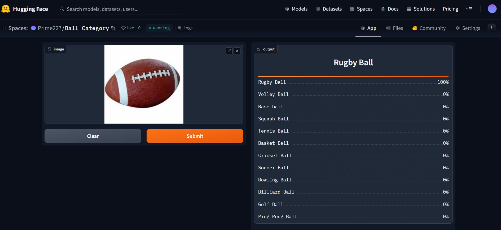

# Ball_Recognizer

An image classification model from data collection , cleaning, model training , deployment and API integration.   
The model Can Classify 12 different types of Balls  
The types are following:  
1. Base ball
2. Cricket Ball
3. Soccer Ball
4. Basket Ball
5. Tennis Ball
6. Billiard Ball
7. Bowling Ball
8. Rugby Ball
9. Ping Pong Ball
10. Squash Ball
11. Volley Ball
12. Golf Ball
# Dataset preparation
**Data Collection:** Downloaded from google 
**Data Loader:** used fasai DataBlock API to set up the Data Loader 
**Data Augmentation:** Fastai provides default data augmentation which operates in GPU.  

# Data Training 
**Data Trainning:** Fine-tuned a resnet34 model for 2 epochs and got upto ~92% accuracy . 
**Data cleaning:** Due to noises from browsed data , i cleaned and updated data using fastai ImageClassifierCleaner. 
# Model Deployment
I deployed the model to Huggingface spaces Gradio App. The implementation can found in [here](https://huggingface.co/spaces/Prime227/Ball_Category) . 

# API Integration with Github pages
The deployed model API is integrated [here](https://gkayan.github.io/Ball_Recognizer/) in Github Pages Website .
